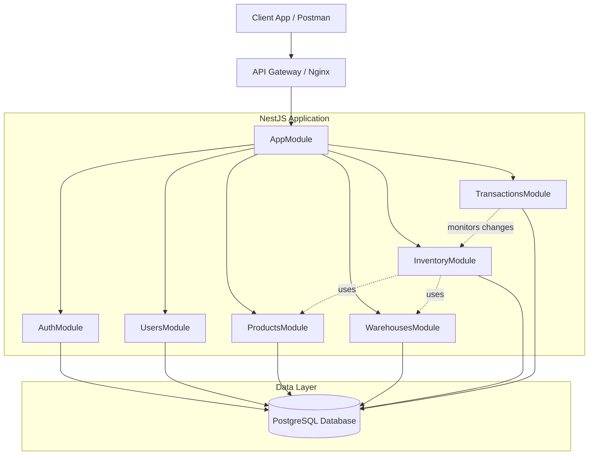
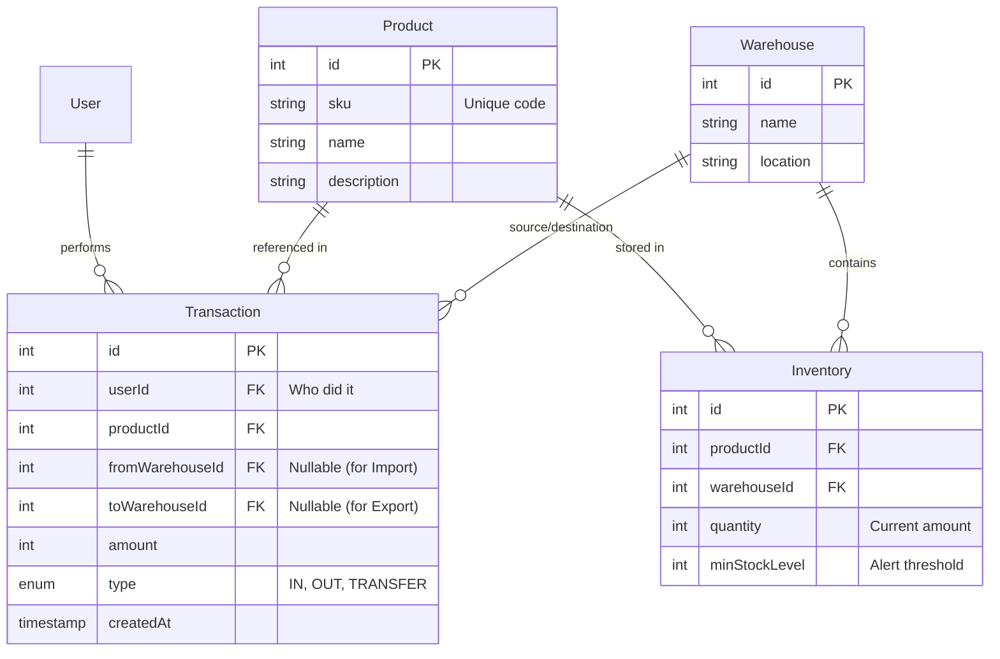

# Smart Warehouse API 🏭

## Project Description
Smart Warehouse API is a RESTful service designed to automate warehouse inventory management. The system allows businesses to manage product stocks, track item movements between different locations (warehouses), and maintain a strict history of all transactions (supplies, write-offs, transfers).

This project is developed as part of a Node.js university course.

## Core Idea
Businesses often face issues with stock discrepancies ("phantom inventory") or loss of goods. This API solves these problems by enforcing strict transactional integrity for any change in stock levels. Every change is recorded; nothing is simply "deleted."

### Key Entities
1.  **Product**: Basic item details (Name, SKU, Description, Measurement units).
2.  **Warehouse**: Physical storage locations (e.g., "Main Warehouse", "Downtown Store").
3.  **Inventory (Stock)**: The association entity tracking how much of a specific Product exists in a specific Warehouse.
4.  **Transaction**: An immutable record of stock changes. Types: `IN` (Supply), `OUT` (Sale/Write-off), `TRANSFER` (Moving between warehouses).

## Functional Requirements (MVP)
- [ ] **Auth**: User registration and authentication via JWT. Roles: `Admin`, `Manager`.
- [ ] **Products**: CRUD operations for product management.
- [ ] **Warehouses**: Creation and management of storage locations.
- [ ] **Operations**:
    - *Supply*: Adding new items to a warehouse.
    - *Transfer*: Moving items between warehouses with transactional safety.
    - *Sale/Write-off*: Reducing stock due to sales or damage/loss.
- [ ] **Audit**: Viewing the movement history of a specific product.

## Tech Stack
- **Runtime**: Node.js
- **Framework**: NestJS
- **Language**: TypeScript
- **Database**: PostgreSQL
- **ORM**: Prisma (or TypeORM)
- **Validation**: class-validator
- **Documentation**: Swagger (OpenAPI)
- **Testing**: Jest (Unit, E2E)
- **Containerization**: Docker
- **CI/CD**: GitHub Actions

## Installation and Running

```bash
# Install dependencies
$ npm install

# Run in development mode
$ npm run start:dev

# Run tests
$ npm run test
```

## Architecture & Design (Lab 2)

### 1. Component Diagram (Modules)
The application follows the modular architecture provided by NestJS. Each feature is encapsulated in its own module containing the Controller (API layer), Service (Business Logic), and Repository (Data Access).



### 2. Entity-Relationship Diagram (ERD)
The database is normalized to ensure data integrity. The central entity is `Inventory` (Stock), linking Products to Warehouses.



### 3. Key Data Scenarios

#### Scenario A: Supply (Inbound Transaction)
**Goal**: Add new items to a specific warehouse.
1.  **Input**: `warehouseId`, `productId`, `amount`.
2.  **Process**:
    * System checks if an `Inventory` record exists for this Product+Warehouse pair.
    * If **Yes**: Update `Inventory.quantity = Inventory.quantity + amount`.
    * If **No**: Create a new `Inventory` record with initial quantity.
    * Create a `Transaction` record with type `IN`.
3.  **Result**: Stock increases, audit log created.

#### Scenario B: Internal Transfer
**Goal**: Move goods from Warehouse A to Warehouse B.
1.  **Input**: `fromWarehouseId`, `toWarehouseId`, `productId`, `amount`.
2.  **Process**:
    * **Validation**: Check if `Inventory` at `fromWarehouseId` has enough quantity (`quantity >= amount`).
    * **Atomic Operation (DB Transaction)**:
        * Decrement `quantity` at Source Warehouse.
        * Increment `quantity` at Target Warehouse (or create record if missing).
        * Create `Transaction` record with type `TRANSFER`.
    * If any step fails, the entire operation rolls back.
3.  **Result**: Total system stock remains same, distribution changes.

#### Scenario C: Sale / Write-off (Outbound)
**Goal**: Reduce stock due to sale or damage.
1.  **Input**: `warehouseId`, `productId`, `amount`, `reason`.
2.  **Process**:
    * Check availability.
    * Decrement `Inventory.quantity`.
    * Create `Transaction` record with type `OUT`.
3.  **Result**: Stock decreases.